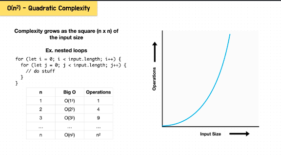

# Big O

- measures how long an algorithm takes to run

- helps you write better code
- helps refactor bad or slow code

- scalability - will it work in production? will it work for end users?
- readability - is it clean? is it readable? is it modular? can other coders undertand it?

* when we talk about big O, we are talking about how scalable code is. if it's a good solution, it must be scalable:
  - will it work in production?
  - will it handle a lot of data?
  - will it be fast?

- timing an algorithm has too much dependence on external factors (speed of computer, what code is used, etc), so not a fair way to determine how good the code is

- so to objectively say one algorithm is better than another...

* big O objectively measures how an algorithm scales
* scalability is directly related to input size and the number of operations as input size grows very large

* n is the input size

* big O is a measure of number operations based on a large size

* O(n): operations required == input size (one loop)
* O(n^2) : operations required == n x n (nested loops)

* time is the number of operations requried to execute an algorithm

* 4 steps for calculating Big O

1. worst case - given worst input, how will algorithm perform?
2. drop constants - just care about lineear time
3. drop less significant terms - we care when input is very large
4. account for all input -

# O(n) - Linear Complexity

- this happens when we iterate through our input data structure once (or sequentially). as long as we don't nest loops

- if we have an input array with length 1,000,000 our for loop would iterate through one million items; simply means the operations required is the length of the input

e.g. forEach, map, filter, reduce - all iterate through our input data structure once just like a for loop

- the operations performed in the algorithm grow 1-for-1 (linearly) as size of the input grows

- ex. for loops

```
  - for (let i=0 i< input.length; i++) {
    //do stuff
  }

```

.png>)

the number of operations is the same as the input size

# O(n^2) Quadratic Complexity

complexity grows as the square (n x n) of the input size

e.g. nested loops

```
for (let i = 0; i < input.length; i++){
  for (let j=0; j < input.length; j++) {
    //do stuff
  }
}

```



# Constant time O(1)

- means we don't iterate through our data structure

* the operations never increase regardless of how large the input is

e.g.
accessing a hash table by key, popping the last item of an array, or normal arithmetic
